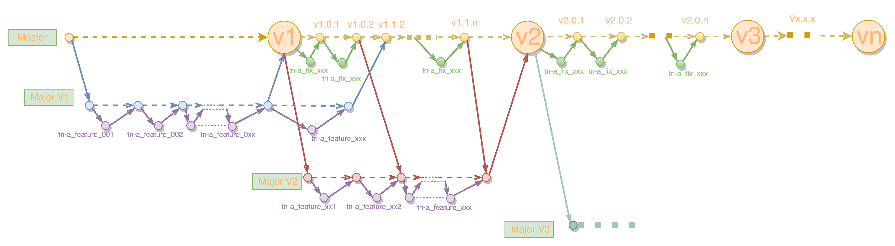

##  Git使用

#### 参考资料

1.  [git教程（含简介、安装、使用、Git服务器搭建等）](http://www.runoob.com/git/git-tutorial.html)
2.  [git使用文档](https://yhui02.gitbooks.io/git-doc/content/git-01-关于.html)

### 简介

Git 是 Linus Torvalds (Linux之父)为了帮助管理 Linux 内核开发而发明的一个开放源码的版本控制软件。

Git 目前支持 Linux/Unix、Solaris、Mac和 Windows 平台上运行。[Git 各平台安装包下载地址 ](http://git-scm.com/downloads)

##### 主要特点

-   完全分布式；

-   对非线性开发模式的强力支持（允许上千个并行开发的分支），可以应付各种复杂的项目开发需求（Docker内部集成了Git）；

-   方便地利用分支进行开发的工作流程，不需要创建一个源代码目录的完整副本；

-   支持多个远程仓库，方便实施敏捷；

-   它的速度飞快，极其适合管理大项目；

    >   commit 和 push 更快。
    >
    >   体现在 push 到远程仓库时 Git 会先对所有需要上传的文件进行 zip 打包压缩，然后一次性传输，在远程服务器解压，全部自动完成。而 SVN 则是一个一个文件地上传，代码是纯文本，总体积并不大，但是大量零碎的小文件频繁建立网络连接造成延迟。这在升级第三方的库或者框架时，成千上万的文件更新更加让人难以忍受。

-   Git 中的绝大多数操作都只需要访问本地文件和资源，不用连网（如果用 CVCS 的话，差不多所有操作都需要连接网络），就算你在飞机或者火车上，都可以非常愉快地频繁提交更新，等到了有网络的时候再上传到远程仓库；

-   更方便主程做 code review，控制代码质量。创建主仓库，多人开发时使用 fork 模式，每个人拥有自己独立的 repo，独立的 trunk / branches，最后发送 pull request 进行代码合并；

-   社区提供类似 GitHub 的 GitLab 免费管理工具。将代码托管在自己内部服务器上的同时，提供了优美的 web 界面，图形化分支结构，代码审查、统计、issue 系统、wiki 等功能全面集成；

-   hook 可以更方便做自动化部署。当然这个 SVN 也有。

### 名词解释

工作区：就是在电脑里能看到的目录;

暂存区：英文叫stage或index。一般存放在`.git`目录下的index文件`.git/index`中，所以我们有时也把暂存区叫作索引（index）;

版本库：工作区有一个隐藏目录`.git`，这个不算工作区，而是Git的版本库。


图中左侧为工作区，右侧为版本库。在版本库中标记为`index`的区域是暂存区（stage, index），标记为`master`的是 master 分支所代表的目录树。

图中我们可以看出此时`HEAD`实际是指向 master 分支的一个"游标"。所以图示的命令中出现 HEAD 的地方可以用 master 来替换。

图中的 objects 标识的区域为 Git 的对象库，实际位于`.git/objects`目录下，里面包含了创建的各种对象及内容。

当对工作区修改（或新增）的文件执行`git add`命令时，暂存区的目录树被更新，同时工作区修改（或新增）的文件内容被写入到对象库中的一个新的对象中，而该对象的ID被记录在暂存区的文件索引中。

当执行`git commit`时，暂存区的目录树写到版本库（对象库）中，master 分支会做相应的更新。即 master 指向的目录树就是提交时暂存区的目录树。

当执行`git reset HEAD`命令时，暂存区的目录树会被重写，被 master 分支指向的目录树所替换，但是工作区不受影响。

当执行`git rm --cached <file>`命令时，会直接从暂存区删除文件，工作区则不做出改变。

当执行`git checkout .`或者`git checkout -- <file>`命令时，会用暂存区全部或指定的文件替换工作区的文件。这个操作很危险，会清除工作区中未添加到暂存区的改动。

当执行`git checkout HEAD .`或者`git checkout HEAD <file>`命令时，会用 HEAD 指向的 master 分支中的全部或者部分文件替换暂存区以及工作区中的文件。这个命令也是极具危险性的，因为不但会清除工作区中未提交的改动，也会清除暂存区中未提交的改动。

### 配置

Git 提供了一个叫做 git config 的工具，专门用来配置或读取相应的工作环境变量。

这些环境变量决定了 Git 在各个环节的具体工作方式和行为。

这些变量可以存放在以下三个不同的地方：

1.  /etc/gitconfig 文件：系统中对所有用户都普遍适用的配置

    若使用 git config 时用 --system 选项，读写的就是这个文件

2.  ~/.gitconfig 文件：用户目录下的配置文件只适用于该用户

    若使用 git config 时用 --global 选项，读写的就是这个文件

3.  */workPath/* .git/config ：当前项目的 .git 目录中的配置文件

    这里的配置仅仅针对当前项目有效。

每一个级别的配置都会覆盖上层的相同配置，所以 */workPath/*.git/config 里的配置会覆盖 /etc/gitconfig 中的同名变量。

>   在 Windows 系统上，Git 会找寻用户主目录下的 .gitconfig 文件。主目录即 $HOME 变量指定的目录，一般都是 C:\Documents and Settings\$USER。此外，Git 还会尝试找寻*/installPath/*etc/gitconfig 文件，只不过看当初 Git 装在什么目录，就以此作为根目录来定位。

### 基本操作

1.  创建仓库

git init 命令用来创建一个git仓库

```bash
;在当前目录创建一个git仓库
git init
;在myrepo目录下创建,不存在时会自动创建
git init myrepo
;创建一个裸git仓库。--bare参数,指定创建一个裸仓库,一个裸仓库是指不包含工作目录的git仓库,它适合用来作为git服务器保存的仓库
git init --bare
```

2.  克隆仓库

git clone用来克隆一个git仓库

```bash
;克隆repo仓库至directory目录,directory可省略,默认为当前目录
git clone <repo> <directory>
;克隆repo仓库为裸仓库,保存至directory.git目录.一般约定俗成裸版本库的目录名以.git做后缀
git clone --bare <repo> <directory.git>
;--bare与--mirror基本相同,只是通过--mirror克隆的裸仓库,可以通过git fetch命令和上游版本库进行持续同步
git clone --mirror <repo> <directory.git>
```

3.   其它常用git命令
*   将新增文件或变更文件从工作区添加到暂存区

```bash
;后面可跟多个文件名,以空格分开,如果要添加当前目录下所有文件,也可以直接用*代替
git add <filename>
```
* 查看仓库状态

```bash
;git status -s  可以显示简短结果
git status
```
* 比较变更

```bash
;查看工作区与暂存区的比较
git diff
;查看暂存区与版本库HEAD指向的版本的比较
git diff --cached
;查看工作区及暂存区与版本库HEAD指向的版本的比较
git diff HEAD
;显示摘要而非整个diff,可搭配`--cached/HEAD`使用,如`git diff --stat --cached`
git diff --stat
```
* 提交变更
```bash
;将暂存区保存的变更提交至版本库,如:`git commit -m "这里填写此次提交变更说明"`
git commit
```

*   查看、增加、删除分支
```bash
;显示本地仓库所有分支
git branch
;显示本地及远程分支
git branch -a
;显示远程所有分支
git branch -r
;删除远程名为remotebranchname的分支
git branch -r -d <remotebranchname> 
;创建名为newbranchname的分支
git branch <newbranchname>
;删除本地branchname分支
git branch -d <branchname>
;重命名分支
git branch -m <oldbranchname> <newbranchname>
```

*   切换分支

```bash
;切换分支
git checkout <newbranchname>
;基于当前分支创建newbranchname分支,并切换至newbranchname
git checkout -b <newbranchname>
```

*   合并分支
```bash
;合并branchname分支与当前分支
;在merge过程中可能存在冲突,那么需要编辑冲突文件,然后add、commit已解决冲突的文件,即可完成合并工作
git merge <branchname>

;`--no-ff`  强行关闭fast-forward方式
;fast-forward方式就是当条件允许的时候，git直接把HEAD指针指向合并分支的头，完成合并,属于“快进方式”.
;不过这种情况如果删除分支，则会丢失分支信息。因为在这个过程中没有创建commit
git merge --no-ff <branchname>

;`--squash` 压缩不必要的commit
;如果在开发时写的commit很乱，而在合并时不希望把这些历史commit带过来，于是使用--squash进行合并，此时文件已经同合并后一样了，但不移动HEAD，不提交。需要进行一次额外的commit来“总结”一下，然后完成最终的合并
git merge --squash <branchname>
```

*   删除文件
```bash
;从暂存区及工作目录删除文件
git rm <file>
;如果只希望删除暂存区的文件可以使用--cached参数
git rm --cached <file>
```
*   重命名文件
```bash
;git mv 命令即以下操作的组合: 
;1. `git rm --cached` 命令的操作
;2.重命名磁盘上的文件
;3.执行 `git add` 把新文件添加到缓存区
git mv <file> <new-file>
```

*   查看历史提交记录

```bash
git log
;--oneline 显示简介提交记录
;--oneline --graph 显示拓扑图
;--reverse --oneline 逆向查看提交记录
;--author=authorname 显示指定用户的提交记录
;-n n代表显示的行数
;--since= 自指定时间开始的提交记录,如--since={2010-04-18}
;--before= 指定时间以前的提交记录,如--before={3.weeks.ago}
```

*     标签操作

```bash
;显示所有标签
git tag
;git tag <tagname> 在最新的commit上添加名为tagname的标签
;git tag -a <tagname> -m`创建标签的同时为标签添加附注"
;git tag <tagname> commitID 为指定的commit添加标签
```

*   拉取更新

```bash
;将远程仓库中指定分支的更新拉取到本地仓库中（更新的内容在本地仓库中的远程分支上）
git fetch [远程库名] [远程分支名]
;将远程仓库中指定分支的更新拉取到本地仓库中,并自动用本地分支合并远程分支
git pull [远程库名] [远程分支名]
```

*   推送更新

```bash
git push [远程库名] [本地分支名] : [远程分支名]
```

4.  终极命令
```bash
;可查看所有git命令的说明文档
git help
;查看子命令的详细文档,如`git merge --help`
git command --help
```

### 分支管理



##### 说明

*   master分支作为主分支，保存项目各阶段稳定态。    master分支本身不包含直接的代码编辑操作，而是通过对开发主线分支、bug修补分支的合并实现功能增加、删减、维护；
*   major_v1、major_v2...major_vn是项目发展不同阶段的开发主线，是一个或多个功能实现的集合。major_vx与major_vy之间不应该产生直接关系，各major主线只与master分支产生关联。这样的机制可以保证多个major主线独立进行。与master分支相同，major分支上不直接包含代码编辑操作；
*   功能及bug修复分支命名规则：`totalNum`-`developerName`\_`feature/fix`\_signNum,如36-arvin_feature_029的含义就是开发者由arvin开发的第29个功能分支，其中36代表所有功能分支与bug fix分支数（不区分开发者）之和；（totalNum在GitLab中创建完issue后获得）
*   同一major下不同feature之间不一定具有依赖关系，可同时进行。


### TIP

1.   大小写敏感

git在windows中默认对大小写不敏感，因此需要配置使其区分大小写

```bash
git config --global core.ignorecase false
```

2.  配置用户信息

git为每次commit提交记录提交者的名字及联系邮箱,因此我们在安装好git以后就可以设置自己的名字及邮箱信息

```bash
git config --global user.name 'fun'
git config --global user.email test@fun.com
```

3.  添加远程仓库

有时我们需要把本地仓库推送到多个远程仓库,这个时候就需要添加远程仓库

```bash
git remote add  <remote_name> <remote_repo_url>
```

以上就添加了一个名为remotename的远程仓库.后续推送更新时执行git push remote_name local_branch_name:remote_branch_name 即可

4.  Windows兼容Linux软链接

默认情况Windows系统下无法识别Linux软链接，Git for Windows v2.7.0客户端提供了这种支持，但要求Windows版本为Windows Vista以后的新版本(我在Win7也没有成功，Win10没问题)

git客户端也要以管理员身份运行

```Bash
git clone -c core.symlinks=true <repo_url>
```

5.  同步所有分支

*   push

```bash
;第一种
git push REMOTE *:*
;第二种
git push REMOTE --all
```
*   pull

```bash
;第一种
git fetch --all
;第二种  相当于先git fetch --all，然后再merge当前分支，而不是合并所有分支
git pull --all
```
