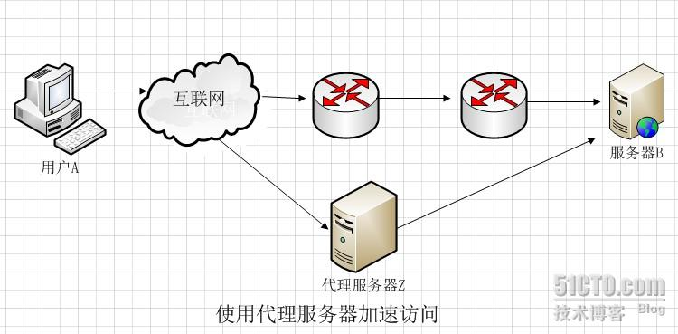
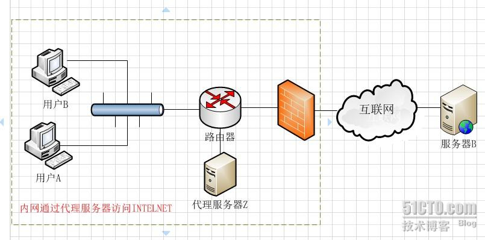
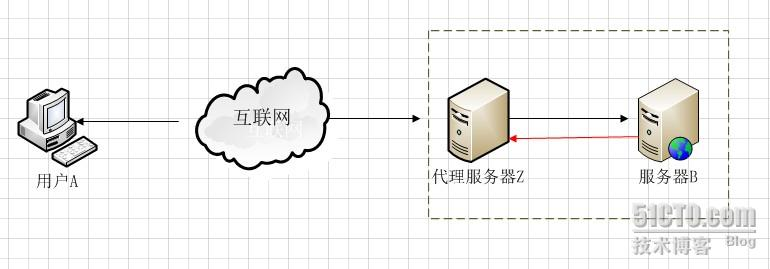
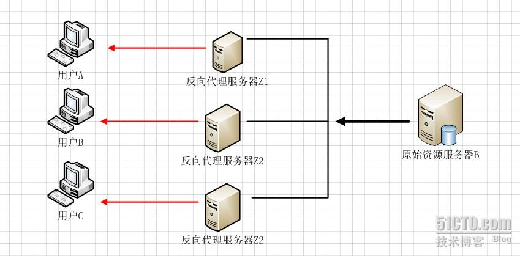
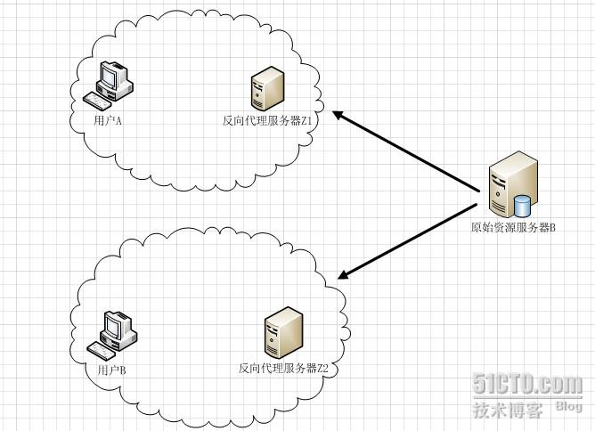

## 正向代理、反向代理、透明代理

原文：http://z00w00.blog.51cto.com/515114/1031287

套用古龙武侠小说套路来说，代理服务技术是一门很古老的技术，是在互联网早期出现就使用的技术。一般实现代理技术的方式就是在服务器上安装代理服务软件，让其成为一个代理服务器，从而实现代理技术。常用的代理技术分为正向代理、反向代理和透明代理。本文就是针对这三种代理来讲解一些基本原理和具体的适用范围，便于大家更深入理解代理服务技术。

### 一、正向代理(Forward Proxy)

一般情况下，如果没有特别说明，代理技术默认说的是正向代理技术。关于正向代理的概念如下：
正向代理(forward)是一个位于客户端【用户A】和原始服务器(origin server)【服务器B】之间的服务器【代理服务器Z】，为了从原始服务器取得内容，用户A向代理服务器Z发送一个请求并指定目标(服务器B)，然后代理服务器Z向服务器B转交请求并将获得的内容返回给客户端。客户端必须要进行一些特别的设置才能使用正向代理。如下图1.1

从上面的概念中，我们看出，文中所谓的正向代理就是代理服务器替代访问方【用户A】去访问目标服务器【服务器B】。

这就是正向代理的意义所在。而为什么要用代理服务器去代替访问方【用户A】去访问服务器B呢？这就要从代理服务器使用的意义说起。

使用正向代理服务器作用主要有以下几点：

* 1.访问本无法访问的服务器B，如下图1.2

我们抛除复杂的网络路由情节来看图1.2，假设图中路由器从左到右命名为R1,R2。

假设最初用户A要访问服务器B需要经过R1和R2路由器这样一个路由节点，如果路由器R1或者路由器R2发生故障，那么就无法访问服务器B了。但是如果用户A让代理服务器Z去代替自己访问服务器B，由于代理服务器Z没有在路由器R1或R2节点中，而是通过其它的路由节点访问服务器B，那么用户A就可以得到服务器B的数据了。

现实中的例子就是“翻墙”。不过自从VPN技术被广泛应用外，“翻墙”不但使用了传统的正向代理技术，有的还使用了VPN技术。 

* 2.加速访问服务器B

这种说法目前不像以前那么流行了，主要是带宽流量的飞速发展。早期的正向代理中，很多人使用正向代理就是提速。还是如图1.2。

假设用户A到服务器B，经过R1路由器和R2路由器，而R1到R2路由器的链路是一个低带宽链路。而用户A到代理服务器Z，从代理服务器Z到服务器B都是高带宽链路。那么很显然就可以加速访问服务器B了。 

* 3.Cache作用

Cache（缓存）技术和代理服务技术是紧密联系的（不光是正向代理，反向代理也使用了Cache（缓存）技术。还如上图所示，如果在用户A访问服务器B某数据J之前，已经有人通过代理服务器Z访问过服务器B上得数据J，那么代理服务器Z会把数据J保存一段时间，如果有人正好取该数据J，那么代理服务器Z不再访问服务器B，而把缓存的数据J直接发给用户A。这一技术在Cache中术语就叫Cache命中。如果有更多的像用户A的用户来访问代理服务器Z，那么这些用户都可以直接从代理服务器Z中取得数据J，而不用千里迢迢的去服务器B下载数据了。

* 4.客户端访问授权

这方面的内容现今使用的还是比较多的，例如一些公司采用ISA SERVER 做为正向代理服务器来授权用户是否有权限访问互联网，挼下图1.3

图1.3防火墙作为网关，用来过滤外网对其的访问。假设用户A和用户B都设置了代理服务器，用户A允许访问互联网，而用户B不允许访问互联网（这个在代理服务器Z上做限制）这样用户A因为授权，可以通过代理服务器访问到服务器B，而用户B因为没有被代理服务器Z授权，所以访问服务器B时，数据包会被直接丢弃。

* 5.隐藏访问者的行踪

如下图1.4 我们可以看出服务器B并不知道访问自己的实际是用户A，因为代理服务器Z代替用户A去直接与服务器B进行交互。如果代理服务器Z被用户A完全控制（或不完全控制），会惯以“肉鸡”术语称呼。
 

我们总结一下 正向代理是一个位于客户端和原始服务器(origin server)之间的服务器，为了从原始服务器取得内容，客户端向代理发送一个请求并指定目标(原始服务器)，然后代理向原始服务器转交请求并将获得的内容返回给客户端。客户端必须设置正向代理服务器，当然前提是要知道正向代理服务器的IP地址，还有代理程序的端口。

### 二、反向代理（reverse proxy）

反向代理正好与正向代理相反，对于客户端而言代理服务器就像是原始服务器，并且客户端不需要进行任何特别的设置。客户端向反向代理的命名空间(name-space)中的内容发送普通请求，接着反向代理将判断向何处(原始服务器)转交请求，并将获得的内容返回给客户端。

使用反向代理服务器的作用如下：

* 1.保护和隐藏原始资源服务器

如下图2.1
 

用户A始终认为它访问的是原始服务器B而不是代理服务器Z，但实用际上反向代理服务器接受用户A的应答，从原始资源服务器B中取得用户A的需求资源，然后发送给用户A。由于防火墙的作用，只允许代理服务器Z访问原始资源服务器B。尽管在这个虚拟的环境下，防火墙和反向代理的共同作用保护了原始资源服务器B，但用户A并不知情。

* 2.负载均衡

如下图2.2

当反向代理服务器不止一个的时候，我们甚至可以把它们做成集群，当更多的用户访问资源服务器B的时候，让不同的代理服务器Z（x）去应答不同的用户，然后发送不同用户需要的资源。

当然反向代理服务器像正向代理服务器一样拥有CACHE的作用，它可以缓存原始资源服务器B的资源，而不是每次都要向原始资源服务器B请求数据，特别是一些静态的数据，比如图片和文件，如果这些反向代理服务器能够做到和用户X来自同一个网络，那么用户X访问反向代理服务器X，就会得到很高质量的速度。这正是CDN技术的核心。如下图2.3
 

我们并不是讲解CDN，所以去掉了CDN最关键的核心技术智能DNS。只是展示CDN技术实际上利用的正是反向代理原理这块。

反向代理结论与正向代理正好相反，对于客户端而言它就像是原始服务器，并且客户端不需要进行任何特别的设置。客户端向反向代理的命名空间(name-space)中的内容发送普通请求，接着反向代理将判断向何处(原始服务器)转交请求，并将获得的内容返回给客户端，就像这些内容原本就是它自己的一样。

基本上，网上做正反向代理的程序很多，能做正向代理的软件大部分也可以做反向代理。开源软件中最流行的就是squid，既可以做正向代理，也有很多人用来做反向代理的前端服务器。另外MS ISA也可以用来在WINDOWS平台下做正向代理。反向代理中最主要的实践就是WEB服务，近些年来最火的就是Nginx了。网上有人说NGINX不能做正向代理，其实是不对的。NGINX也可以做正向代理，不过用的人比较少了。

### 三、透明代理

如果把正向代理、反向代理和透明代理按照人类血缘关系来划分的话。那么正向代理和透明代理是很明显堂亲关系，而正向代理和反向代理就是表亲关系了。

透明代理的意思是客户端根本不需要知道有代理服务器的存在，它改编你的request fields（报文），并会传送真实IP。注意，加密的透明代理则是属于匿名代理，意思是不用设置使用代理了。

透明代理实践的例子就是时下很多公司使用的行为管理软件。如下图3.1
 

用户A和用户B并不知道行为管理设备充当透明代理行为，当用户A或用户B向服务器A或服务器B提交请求的时候，透明代理设备根据自身策略拦截并修改用户A或B的报文，并作为实际的请求方，向服务器A或B发送请求，当接收信息回传，透明代理再根据自身的设置把允许的报文发回至用户A或B，如上图，如果透明代理设置不允许访问服务器B，那么用户A或者用户B就不会得到服务器B的数据。